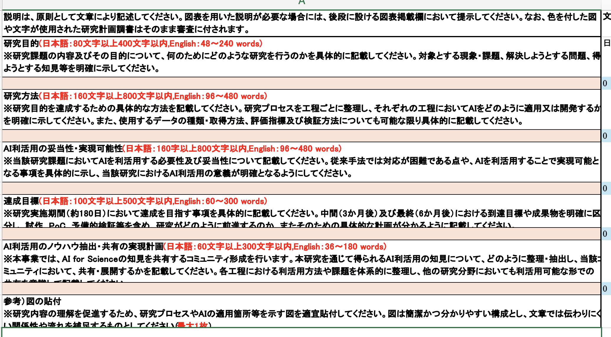
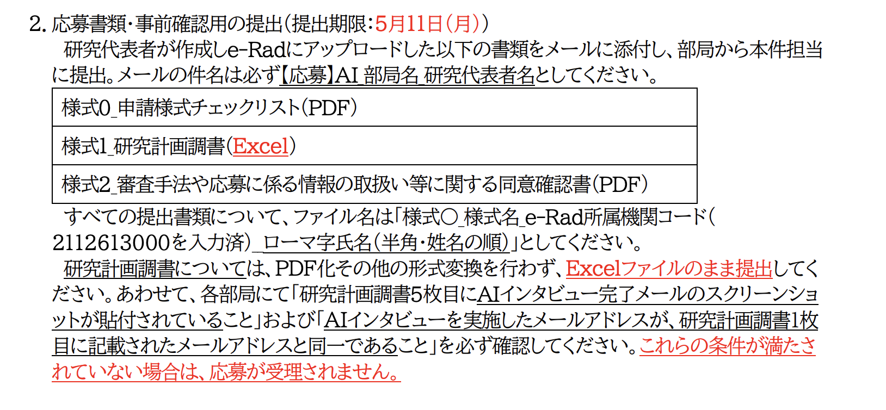

-   [ ] ai safty
    -   current
        -   [X] 募集要項のリンク
        
        -   [X] 締め切りなどの情報
            -   5/8
                研究科の締め切り
            -   5/11
                研究代表者は、e-Rad上で所属機関に対する研究インテグリティの確保に係る誓約状況を登録してください。登録が済んでいないと、応募が受理されません。
            -   5/15
                応募書類・最終版の提出（提出期限：5月15日（金）正午）各部局および研究支援課による事前確認を経て、
                最終版としてe-Radにアップロードした書類をメールに添付し、部局から本件担当に提出。メールの件名は必ず【応募】AI部局名研究代表者名としてください。
        
        -   [X] 提出するもの→excelベース
            -   [X] 記入する内容は？

-   pending
    -   <https://mail.google.com/mail/u/0/?tab=rm&ogbl#search/AI+for+Science/FMfcgzQgLXtHpjsWsGntCcwMFnLLZJGb>
        -   問い合わせ用メルアド
    -   <https://mail.google.com/mail/u/0/?tab=rm&ogbl#search/AI+for+Science/FMfcgzQgLPNbzKGfDJlwcxnHBSPjvwQf>
        -   リーフレットなど
    -   <https://mail.google.com/mail/u/0/?tab=rm&ogbl#search/AI+for+Science/FMfcgzQgLXmLwZLqxRJfRtpRQTHbLhxL>
        -   締め切りなど
    -   AI interview
	    - <https://forms.cloud.microsoft/Pages/ResponsePage.aspx?id=Cy_7LSFNaEKVWXKSYUTJGNIUB3zurnJOqNMFpkqSnB5UODVKR00yNTlVUk5BWDczSFBFV1c5TlhLNy4u>
    
    -   info

# todo

-   [ ] 今の具体的なai safetyの話を理解する→トイモデルについて

-   [ ] これらのトイモデルや現象について，AI safetyやinterpretabilityの文脈でどの程度研究されているのか？
    されていないのか？

-   [ ] されていないなら，やってみてもいいかもしれない．

# memo

---

デジタルネイチャー

---

AI for Science→意図を汲み取った上で論理展開

AI Safetyのどこが，AI for Scienceなのか？

結局はこれもトイモデル

---

(a) Distribution shiftがコア問題：これは偶然ではなく、AVの最大の未解決問題（rare events, OOD, sim-to-real）はすべて分布の問題で、あなたのDSB研究と概念的に直結します。DSBは「ネットワークがモーメントを段階的に学ぶ」話なので、AVでの distribution shift / OOD と数学的に同じ構造を扱える。
(b) 安全性が抽象論ではなく定量的：一般的なAI Safetyと違い、AVは「センサが見落とす」「未知環境で誤動作する」など failure mode が明確。LLCを「safety-relevant な何か」に対応づけやすい。
(c) 日本の産業文脈：SPReADは「我が国の勝ち筋」を意識しているので、AVは政策的に通りやすい。
(d) あなたの既存スキルとの接続：SegFormer/DeepLabV3でセマセグやJetson周りに触れた経験は、AV知覚モデルでそのまま活きる。半年スコープでも手が動く。

---

SLTがAI saftyにどのように繋がってくるのか？

論理的になるためには客観的になる必要がある
客観的になるというのは自分のことではなくて他人のこととして考えること
ドラクエのキャラクターだと思って動けばいい．

---

# Trojaned / backdoored モデル

意図的にバックドアが仕組まれたNNのこと．通常入力に対しては正しく動くが，特定のトリガーが入った場合にのみ，攻撃者が指定した出力を返すように訓練されている．

# Deceptive alignment

欺瞞的なアラインメント

Hubinger et al. "Risks from Learned Optimization" (2019) に由来する概念

---

# Steps

## level 0 道具を知る必要がある

-   mechanistic interpretability の論文
-   

## level 2 AI なんでもいいので1つ問題設定を選ぶ

## paralell 2 AI safetyの問題設定をたくさん知る

### まず自分の問題設定として，dnnを使った自動運転で生じる問題点や困難

→これとai safety

自動運転にどんな技術が使われているか，特にDNN

### 他のドメイン

-   AI saffety

---

