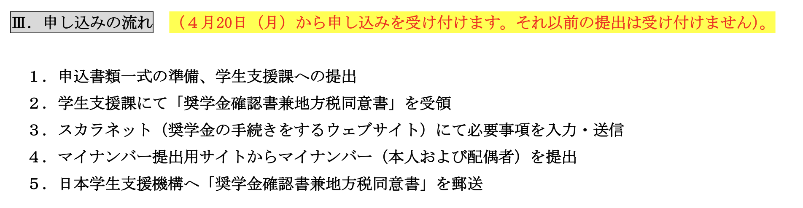

# Overvirw

-   [日本学生支援機構の貸与奨学金 | 奨学金制度 | 経済支援 | 在学生の方へ | 一橋大学](https://www.hit-u.ac.jp/shien/campuslife/shienkikou.html)
    こちらが情報源
    -   修士1年に申し込むJASSOの奨学金応募についてのメモ（作成日2026/04/20）

# やること

-   以下の資料を読んで必要書類を窓口に提出すればOK
-   <https://www.hit-u.ac.jp/shien/campuslife/pdf/scholarship/2026/2026inteiki/01_youryou.pdf>
    -   <https://drive.google.com/open?id=1ET7BBShHz56W_pIkIgQdP9Oj3_YDGYrP&usp=drive_fs>

-   [X] ~~*以下の書類に手書きして提出する必要がある*~~ [2026-06-18 15:38]
    -   <https://www.hit-u.ac.jp/shien/campuslife/pdf/scholarship/2026/2026inteiki/03_shitagaki.pdf>

-   [ ] 在学猶予について調べる

# 資料

-   [X] ~~*まずはとにかく申し込み書類の準備*~~ [2026-06-18 15:37]

-   <https://www.hit-u.ac.jp/shien/campuslife/pdf/scholarship/2026/2026inteiki/02_annai.pdf>
- [X] ~~*[在学猶予 | JASSO](https://www.jasso.go.jp/shogakukin/henkan/houhou/zaigaku_yuyo.html)*~~ [2026-06-18 15:37]
-   [経済的に困難な学生・生徒が活用可能な支援策](https://www.mext.go.jp/a_menu/coronavirus/benefit/index.html)
-   一橋大学，大学院用の奨学金の説明会資料2026
    -   配布のみ
    -   <https://drive.google.com/file/d/1jCIvfAphPi9aev4YpnianfUkRRLuAsPz/view?usp=sharing>

